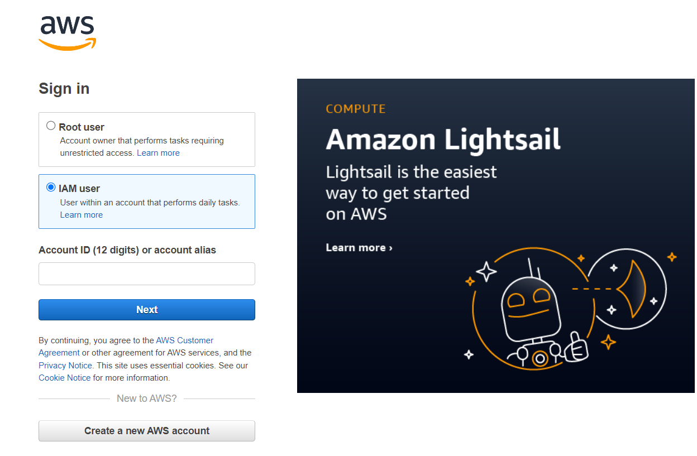
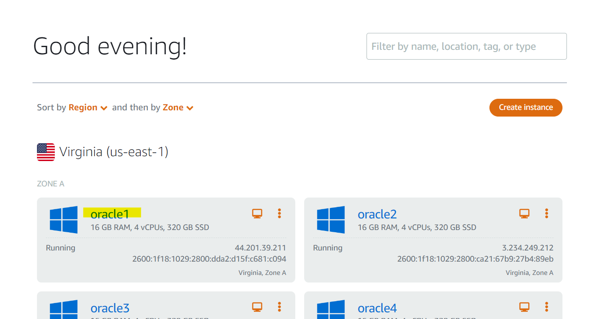
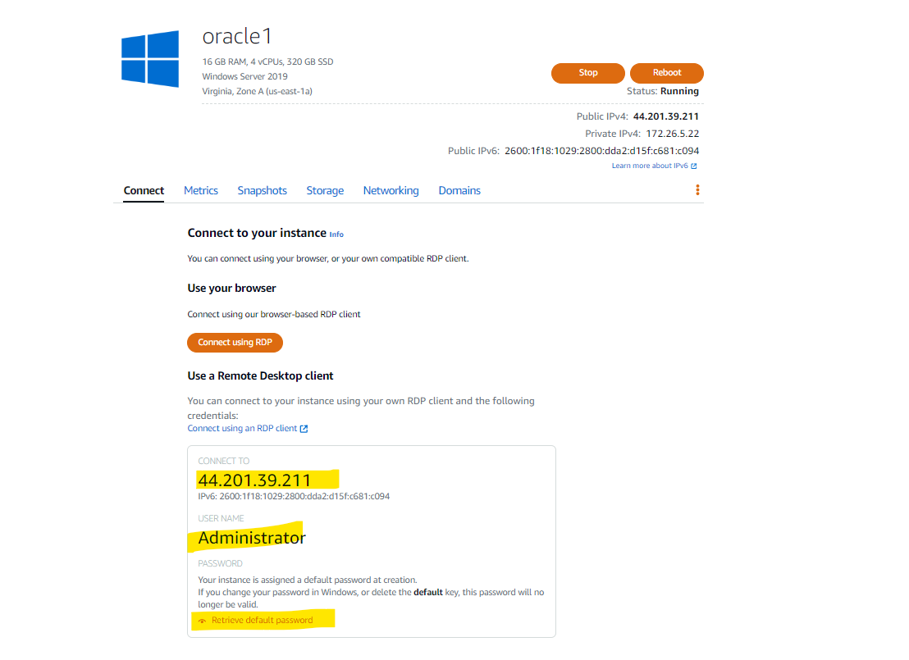
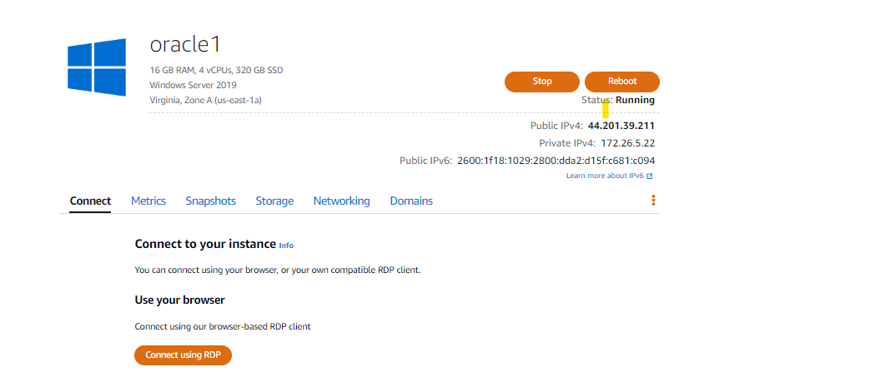

### Lab Environment Connection Steps

Open following URL in the browser:

Sign-in URL: https://lightsail.aws.amazon.com/ls/webapp/home/instances

Click `IAM User`
 
Account ID: **To be provided by Insturctor**

User name: **To be provided by Insturctor**

Password: **To be provided by Insturctor**

Above AWS credentials will be provided by Insturctor; these will be required to login into AWS and then connect with lab environments using RDP client.

**Access Lab Environment**

Please refer to this instruction for accessing lab environment.

1. Click on VM name assigned to you by the instructor as per example shown below:

2. You will see similar screen as per example shown below. Connect using RDP Client by copying following highlighted credentials:

IP Address: Copy from AWS UI

Username: `Administrator`

Password: Click Retrieve default password button

**Browser RDP**

If you are using Mac or don't have RDP client, you can connect with browser RDP. Click `Connect using RDP` button:

